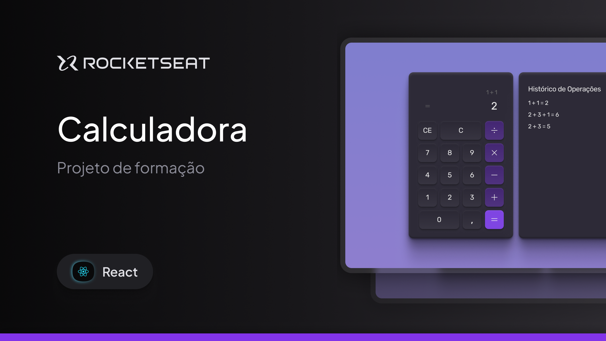

<h1 align="center">Calculadora utilizando React e Tailwind CSS</h1>

Este é um projeto desenvolvido após participar de uma formação de React pela Rocketseat. Foi uma boa oportunidade de praticar e consolidar fundamentos básicos em React e Tailwind CSS.
O objetivo foi criar uma calculadora funcional com uma interface simples, responsiva e agradável.
 

  

  <a href="#-tecnologias">Tecnologias</a>&nbsp;&nbsp;&nbsp;
  

  

## Tecnologias 
Esse projeto foi desenvolvido com as seguintes tecnologias: 
- React 
- Tailwind CSS
- Git e GitHub
- Figma

